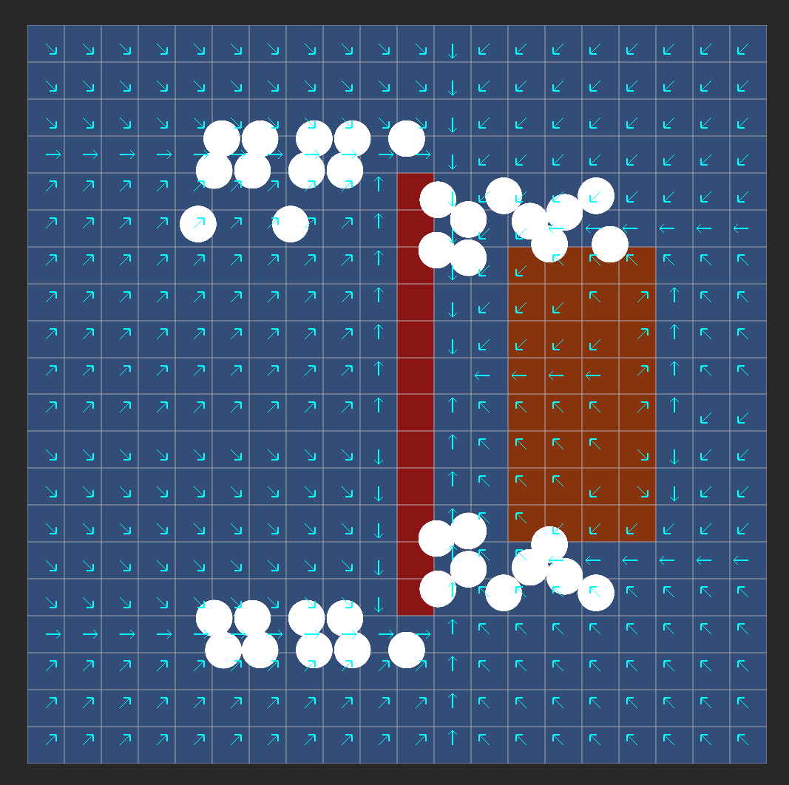

# Flow Field Pathfinding

An implementation of grid-based flow field pathfinding in Unity. It computes a single shared
direction field over a grid and lets any number of agents follow it toward a common
goal, routing around walls and around (but not necessarily through) costly terrain.

---

## Introduction

Most pathfinding is one-to-one: an algorithm such as A\* or Dijkstra computes a
separate path for a single agent from where it is to where it is going. If 500 agents
all chase the same target, that is 500 searches, recomputed every time the situation
changes. A flow field inverts the problem. Instead of a path per agent, it computes
one direction field over the whole grid pointing toward a shared goal, and every
agent reads the cell it stands in to know which way to move. The expensive work is done
once and amortised across the whole crowd: once the field exists, each extra agent costs
only one cheap lookup per frame. Large crowds converging on a single target are where
this pays off.

---

## Design / implementation

The system is a three-stage field-building pipeline plus an agent layer that follows
the result. The terminology (cost field → integration field → flow field) follows
Emerson's "flow field tiles" formulation.

### Project structure

| File | Responsibility |
|------|----------------|
| `FlowField.cs` | Pure algorithm + data: the grid and the three passes. No `MonoBehaviour` dependency except a `Physics2D` query when baking cost. |
| `FlowFieldCell.cs` | One grid cell: traversal `Cost`, integrated `BestCost`, resulting `FlowDirection`. |
| `GridDirection.cs` | Pre-computed neighbour-offset tables (4 cardinal, 8 all). |
| `FlowFieldController.cs` | Scene owner: builds the field, re-bakes on goal change, exposes lookups to agents. |
| `FlowFieldAgent.cs` | Follows the field; adds local separation so a crowd spreads out. |
| `FlowFieldDebugView.cs` / `FlowFieldRuntimeView.cs` | Gizmo and runtime (GL) overlays for the grid, walls and arrows. |

### 1. The grid and cost field

`CreateGrid` lays out a `GridSize.x × GridSize.y` array of cells (20×20 here), each cell's
world centre at `Origin + ((x + 0.5), (y + 0.5)) × CellDiameter`.

`CreateCostField` stamps a per-cell traversal cost from the level geometry, baked once
because it does not depend on the goal. Each cell's centre is tested with a
`Physics2D.OverlapBox` (sized at 90% of a cell so a collider that merely clips a neighbour
is not picked up) against two layer masks: the obstacle mask marks a cell impassable, and
an optional rough-terrain mask raises its cost without blocking it. Costs are stored in a
`byte`, with `255` reserved as the impassable sentinel; the inspector caps the
rough-terrain cost at `2..254`, so a rough value can never accidentally collide with the
wall sentinel.

### 2. The integration field (Dijkstra flood from the goal)

`CreateIntegrationField` computes, for every reachable cell, the cheapest total cost to
reach the goal. Starting from the goal (value `0`), it floods outward, accumulating
each step's entry cost.

The important design choice is that this is a true Dijkstra flood.
The difference matters as soon as terrain costs vary.
Dijkstra expands by lowest accumulated cost so far while
Breadth-first search expands by number of steps.
With a rough-terrain cost of, say, 8, a route that is fewer
steps but crosses the rough patch can be more expensive than a longer detour over cheap
ground and a breadth-first flood, which finalises each cell on first visit, would lock
in the wrong (expensive) value. Dijkstra always expands the cheapest open cell next, so
the cheap detour is finalised before the expensive shortcut can overwrite it. To get that
ordering without depending on `System.Collections.Generic.PriorityQueue` (which is not
guaranteed across Unity's API-compatibility levels), the implementation uses a small
hand-written binary min-heap keyed on integration cost, with lazy deletion: a stale
queue entry (one whose stored priority is worse than the cell's current best) is simply
skipped when popped.

### 3. The flow field

`CreateFlowField` collapses the integration bowl into directions. For each passable cell
it scans all 8 neighbours, picks the one with the lowest `BestCost`, and stores a unit
vector pointing at it. Reading from 8 neighbours (while integrating over 4) lets the
resulting arrows point diagonally, so agents move in smooth diagonals instead of a blocky
staircase. A diagonal candidate is rejected unless **both** shared orthogonal cells are
open, which is the corner-cut guard that stops an agent being routed through the corner of
a wall. The accumulation convention is internally consistent: an agent at cell C choosing
neighbour N pays N's entry cost plus N's own remaining cost, which sums to exactly
`BestCost[N]`, so minimising `BestCost[N]` minimises true remaining travel. Walls and the
goal get a zero direction (no downhill neighbour).

The 4-cardinal / 8-all split is encoded as two pre-computed offset tables in
`GridDirection`, which keeps both passes branch-free and short.

### Re-baking strategy

`FlowFieldController` builds the grid and cost field once in `Start`, then re-runs only
the integration and flow passes when the goal moves (left-click by default). The cost
field is goal-independent, so there is no point rebaking it every time the goal changes.

### The agent layer

A flow field tells an agent which way to go but says nothing about the agents around it,
so FlowFieldAgent adds a local separation behaviour on top. The field gives the overall heading,
and the separation just nudges each agent away from whoever is closest so the crowd does not pile up.
Each frame an agent samples the flow vector for its current cell, adds a weighted
separation push away from nearby agents (weighted by inverse-distance, so the
closer the neighbour the harder the push), and steps. It clamps the steering to maxSpeed,
it uses frame-rate-independent exponential smoothing, and it does wall-slide fallback when a separation would shove an agent into a wall.

---

## Result

The screenshot above is a 20×20 field with the goal in almost the centre, an impassable
wall (red), and a rough-terrain patch (orange). You can read the algorithm's correctness
directly off it:

- The wall is avoided. No arrow points into a red cell; the columns flanking the wall
  run parallel to it and funnel agents up and over the end. This is the cardinal
  integration plus the corner-cut guard working together.
- Rough terrain is costed. Inside the orange patch the arrows diverge.
  The right edge points out toward the goal, but the left and bottom
  cells point back out toward the nearest cheap exit rather than plowing straight across.
  If the patch were ordinary cost-1 ground, every orange cell would point uniformly toward
  the goal like its blue neighbours.
- No dead cells. Every passable cell has exactly one arrow; the only cells without a
  direction are the wall and the goal itself

On performance, the field is built once per goal; thereafter any number of agents read
their cell's vector in O(1) per frame, and the separation layer stays near-linear thanks
to the spatial hash.

---

## Conclusion

Flow fields are worth the trouble when many agents share a few goals that rarely move.
You build the field once and every agent after the first reads it for almost nothing,
so the more agents there are the better the trade looks.
They fall down in the opposite situation.
If you have a handful of agents each heading somewhere different,
you end up rebuilding most of a field per goal and using almost none of it,
and a per-agent search like A* will be cheaper.

---

## References

1. Emerson, E. (2013). Crowd Pathfinding and Steering Using Flow Field Tiles. In
   S. Rabin (Ed.), Game AI Pro: Collected Wisdom of Game AI Professionals (Chapter 23,
   pp. 307–316). CRC Press. Free PDF:
   <https://www.gameaipro.com/GameAIPro/GameAIPro_Chapter23_Crowd_Pathfinding_and_Steering_Using_Flow_Field_Tiles.pdf>
   (Republished in Game AI Pro 360: Guide to Movement and Pathfinding, CRC Press, 2019,
   pp. 67–76, DOI: 10.1201/9780429055096-7.)

2. Dijkstra, E. W. (1959). A Note on Two Problems in Connexion with Graphs.
   Numerische Mathematik, 1, 269–271. DOI: 10.1007/BF01386390. Free PDF:
   <https://ir.cwi.nl/pub/9256/9256D.pdf>

3. Patel, A. Red Blob Games. Introduction to A\* (covers Breadth-First Search,
   Dijkstra's Algorithm, distance maps and flow fields):
   <https://www.redblobgames.com/pathfinding/a-star/introduction.html>; and
   *Tower Defense pathfinding* (Dijkstra maps / flow-field pathfinding worked example):
   <https://www.redblobgames.com/pathfinding/tower-defense/>

4. Reynolds, C. W. (1999). Steering Behaviors For Autonomous Characters. In
   Proceedings of the Game Developers Conference 1999 (pp. 763–782). Miller Freeman Game
   Group. Free article: <https://www.red3d.com/cwr/steer/>

5. Treuille, A., Cooper, S., & Popović, Z. (2006). Continuum Crowds. ACM
   Transactions on Graphics (TOG), 25(3), 1160–1168. DOI: 10.1145/1141911.1142008. Free PDF:
   <https://grail.cs.washington.edu/projects/crowd-flows/continuum-crowds.pdf>